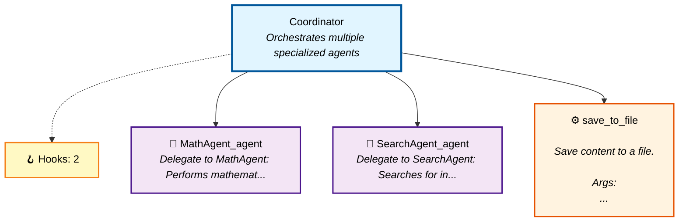

# Agent Flow: Coordinator

```mermaid
graph TB
    Coordinator["Coordinator<br/><i>Orchestrates multiple specialized agents</i>"]:::agent
    Coordinator_hooks["🪝 Hooks: 2"]:::hook
    Coordinator -.-> Coordinator_hooks
    Coordinator_MathAgent_agent["🤖 MathAgent_agent<br/><i>Delegate to MathAgent: Performs mathemat...</i>"]:::agent_tool
    Coordinator --> Coordinator_MathAgent_agent
    Coordinator_SearchAgent_agent["🤖 SearchAgent_agent<br/><i>Delegate to SearchAgent: Searches for in...</i>"]:::agent_tool
    Coordinator --> Coordinator_SearchAgent_agent
    Coordinator_save_to_file["⚙️ save_to_file<br/><i>
    Save content to a file.

    Args:
...</i>"]:::tool
    Coordinator --> Coordinator_save_to_file

    %% Styling
    classDef agent fill:#e1f5ff,stroke:#01579b,stroke-width:3px,color:#000
    classDef tool fill:#fff3e0,stroke:#e65100,stroke-width:2px,color:#000
    classDef agent_tool fill:#f3e5f5,stroke:#4a148c,stroke-width:2px,color:#000
    classDef schema fill:#e8f5e9,stroke:#1b5e20,stroke-width:2px,color:#000
    classDef hook fill:#fff9c4,stroke:#f57f17,stroke-width:2px,color:#000
    classDef provider fill:#fce4ec,stroke:#880e4f,stroke-width:2px,color:#000
```