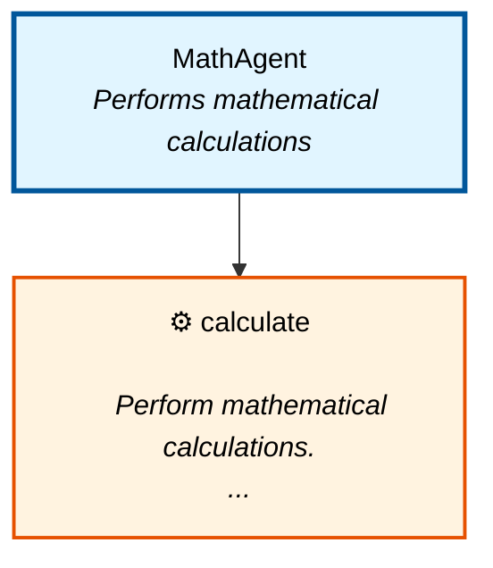

# Agent Flow: MathAgent

```mermaid
graph TB
    MathAgent["MathAgent<br/><i>Performs mathematical calculations</i>"]:::agent
    MathAgent_calculate["⚙️ calculate<br/><i>
    Perform mathematical calculations.
...</i>"]:::tool
    MathAgent --> MathAgent_calculate

    %% Styling
    classDef agent fill:#e1f5ff,stroke:#01579b,stroke-width:3px,color:#000
    classDef tool fill:#fff3e0,stroke:#e65100,stroke-width:2px,color:#000
    classDef agent_tool fill:#f3e5f5,stroke:#4a148c,stroke-width:2px,color:#000
    classDef schema fill:#e8f5e9,stroke:#1b5e20,stroke-width:2px,color:#000
    classDef hook fill:#fff9c4,stroke:#f57f17,stroke-width:2px,color:#000
    classDef provider fill:#fce4ec,stroke:#880e4f,stroke-width:2px,color:#000
```