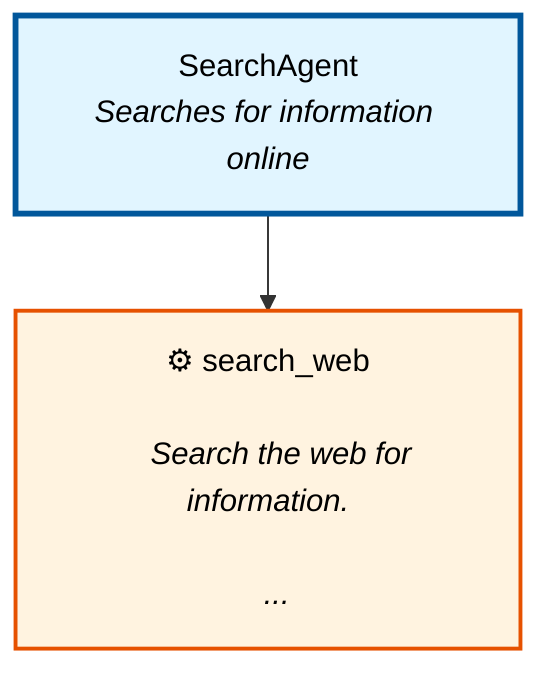

# Agent Flow: SearchAgent

```mermaid
graph TB
    SearchAgent["SearchAgent<br/><i>Searches for information online</i>"]:::agent
    SearchAgent_search_web["⚙️ search_web<br/><i>
    Search the web for information.

  ...</i>"]:::tool
    SearchAgent --> SearchAgent_search_web

    %% Styling
    classDef agent fill:#e1f5ff,stroke:#01579b,stroke-width:3px,color:#000
    classDef tool fill:#fff3e0,stroke:#e65100,stroke-width:2px,color:#000
    classDef agent_tool fill:#f3e5f5,stroke:#4a148c,stroke-width:2px,color:#000
    classDef schema fill:#e8f5e9,stroke:#1b5e20,stroke-width:2px,color:#000
    classDef hook fill:#fff9c4,stroke:#f57f17,stroke-width:2px,color:#000
    classDef provider fill:#fce4ec,stroke:#880e4f,stroke-width:2px,color:#000
```